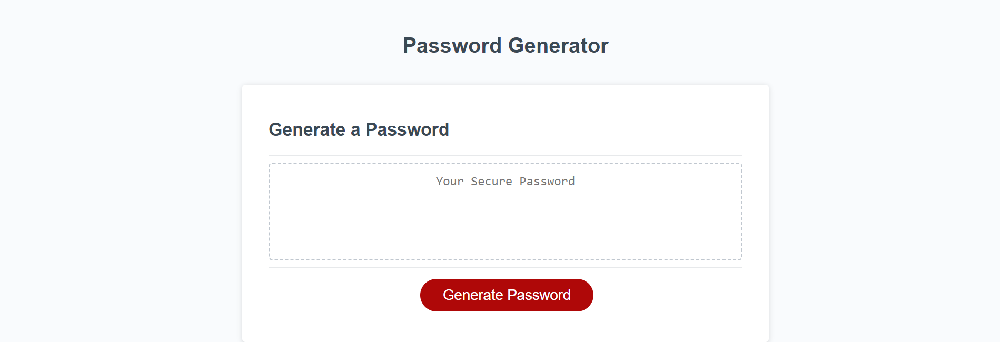

# Password-Generator

## Description

This project uses JavaScript, HTML and CSS to create a Password Generator. Starter code was given for the HTML and CSS files along with script.js file. The script.js file had arrays and some code such as, document.querySelector. The rest of the project was useful practise creating functions and if statements withing a JavaScript file. This project also looked at Math.floor() and Math.random() along with concat() function which is used to join two or more strings together.

## Installation

N/A

## Usage

This project will help beginners to develop confidence working with JavaScript functions and defining variables. It laso consolidated using if statements and for loops. It is a good reference for using concat() function to join two or more strings.

## Credits

The following websites were used to better understand concat() function:
https://developer.mozilla.org/en-US/docs/Web/JavaScript/Reference/Global_Objects/Array/concat

To better understand Functions:
https://www.w3schools.com/js/js_function_definition.asp

To revise Math.floor() and Math.random()
https://developer.mozilla.org/en-US/docs/Web/JavaScript/Reference/Global_Objects/Math/random

## License

Please refer to license in repo.

## Screenshot

